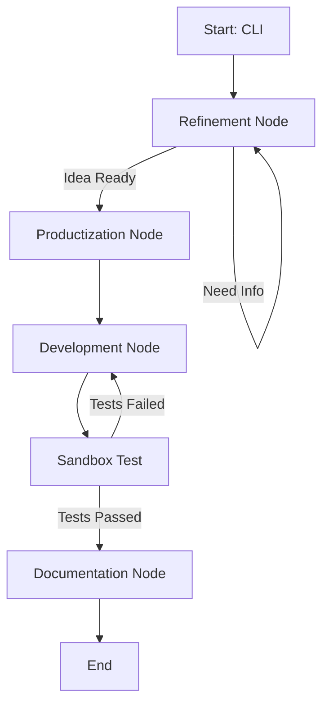

# Architecture Document: Agent Forge

## Stack Tecnológico Base

1. **Linguagem Principal:** Python 3.10+
2. **Orquestração de Agentes:** LangGraph (StateGraph para gestão de fluxos com ciclos).
3. **Modelos Suportados:** LangChain unificado (suporte para `ChatAnthropic`, `ChatGoogleGenerativeAI`, `ChatOpenAI`).
4. **Memória Vetorial:** ChromaDB (roda via container Docker no Compose).
5. **Sandbox de Execução:** SDK do Docker para Python (`docker-py`). Invocação de containers temporários (ex: `python:3.10-alpine` ou `node:18-alpine`) dependendo da stack da task gerada.

## Desenho da Arquitetura (Módulos)

### 1. Core (`agent_forge/core/`)
Contém a inicialização do LangGraph e definição do Estado do Grafo (`State`).
- `state.py`: Define o que trafega entre os nós (ideia, prd_path, issues, status_execução).
- `graph.py`: Conecta os nós (Refinement -> Productization -> Dev -> Validation -> Doc).

### 2. Nodes (`agent_forge/nodes/`) e Skills (Padrão Matt Pocock)
Em vez de lógicas genéricas, os nós implementarão o padrão de **Skills** dividido em User-Invoked e Model-Invoked:
- `refiner.py`: Expõe a skill user-invoked `/grill-me` e `/grill-with-docs`. Aciona o loop de `grilling` para construir o modelo de domínio (`CONTEXT.md`).
- `architect.py`: Executa `/to-prd` e `/to-issues` pegando o output do Refiner e transformando em arquivos acionáveis.
- `developer.py`: O nó mais complexo. Executa de forma autônoma as skills model-invoked: `tdd` (Red-Green-Refactor) e `diagnosing-bugs` mandando código para o Sandbox. Também aplica o `codebase-design`.
- `reporter.py`: Documenta os erros resolvidos e gerencia o repositório (`/handoff` e `/triage`).

### 3. Memory (`agent_forge/memory/`)
Integração com ChromaDB e FileSystem local (`knowledge_base/`).

### 4. Sandbox (`agent_forge/sandbox/`)
- `dind_manager.py`: Comunica-se com o Docker Daemon para rodar os testes. Retorna stdout/stderr para o `developer.py` decidir se conserta os bugs ou se deu sucesso.

## Diagrama de Fluxo (LangGraph)

